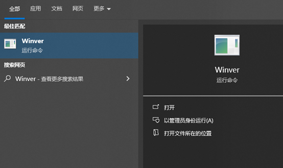
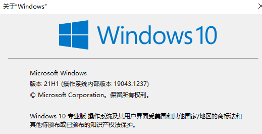
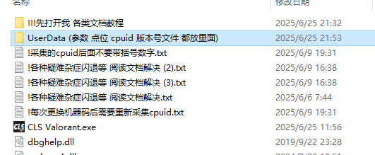
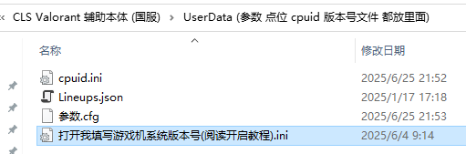
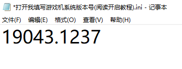
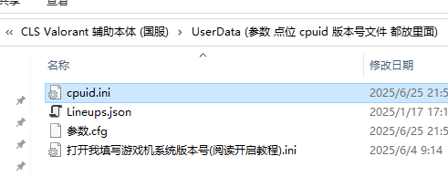

# **CLS开启教程 - 国服(ACE)**

## **开启辅助前的准备操作**
- 辅机关闭所有不必要的软件以使辅助占用最高性能  
- DMA测速正常  
- 填写游戏机系统版本(为防止有些机器初始化键盘失败)  
    - 游戏机按Win键搜索Winver运行  
    -   
    -   
    - 将图中的”19043.1237”填写到指定文件里  
        -   
        -   
        -   
- 右键桌面 -> 显示设置 -> 所有显示器的屏幕缩放率100% (双机都这样调)  
- 融合器用户: 确保副机与主机分辨率及刷新率一致  
- 如需连接盒子:  
    - 游戏机Windows设置关闭提高鼠标精准度  
    - “狙击开镜灵敏度倍数”和”开镜灵敏度倍数”都改1.0  
    - 提示: 无需调盒子自身曲线  如果调了请关闭以避免意外的移动轨迹   辅助自带可调节的二阶曲线  
- 绘制拖框:
    - 游戏设置 ->  画面 -> 开启垂直同步 别关!  
    - CLS菜单 -> 全局设置 -> 开或关垂直同步 (具体自己试)  
    - 补充: 只要副机性能够(靶场开机器人, 软件关闭垂直同步, 绘制FPS>300) 拖框就是设置问题

## **CLS开启教程 - 国服(ACE)**
### **采集游戏机cpuid**

**提示：每次更换机器码/动态机器码后需要重新采集cpuid**  

1. 游戏机关掉游戏进程和游戏客户端  
2. 游戏机双击运行 “游戏机cpuid采集工具(阅读开启教程文档).exe”  
    - 将生成的”cpuid.ini”复制到辅机的指定目录下  
    -   
    -   
    - “cupid.ini”文件名不要带”(1/2/3)”  
3. 最后删除游戏机上的采集工具和cpuid.ini  

### **登录辅助**

上述步骤做完后, 先开辅助或先开游戏都行 游戏到大厅后点连接FPGA设备, 阅读菜单文档  
**提示: 换号或重新运行游戏无需关闭软件 上号后点击连接FPGA设备即可**

