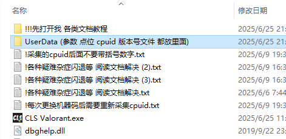
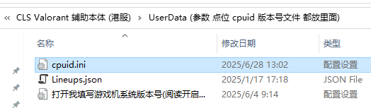
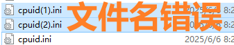

# **CLS开启教程 - 港服(RIOT)**

## **开启辅助前的准备操作**
- DMA测速正常  
- 融合器用户: 确保副机与主机分辨率及刷新率一致  
- 如需连接盒子:  
    - 游戏机Windows设置关闭提高鼠标精准度  
- 绘制拖框:
    - 只要副机性能够(靶场开机器人, 软件关闭垂直同步, 绘制FPS>300) 拖框就是设置问题
    - FPS够仍然拖框大概率融合器问题 将融合器设置为1K240即可  

## **CLS开启教程 - 港服(RIOT)**
### **采集游戏机cpuid**

**提示：每次更换机器码/动态机器码后需要重新采集cpuid**  

1. 游戏机关掉游戏进程和游戏客户端  
2. 游戏机双击运行 “游戏机cpuid采集工具(阅读开启教程文档).exe”  
    - 将生成的”cpuid.ini”复制到辅机的指定目录下  
    -   
    -   
    - “cupid.ini”文件名不要带”(1/2/3)”  
3. 最后删除游戏机上的采集工具和cpuid.ini  

### **登录辅助**

上述步骤做完后, 上游戏后点连接FPGA设备  
**提示: 换号或重新运行游戏无需关闭软件 上号后点击连接FPGA设备即可**  