# **CLS菜单文档**  
## **前言**  
**请先阅读开启教程文档, 本文档只介绍部分菜单, 字面意思的内容不再赘述**  
**CLS承诺所有功能及解密均为只读不动任何内存**  

## **Globals**  

### **FPGA/键鼠盒子**

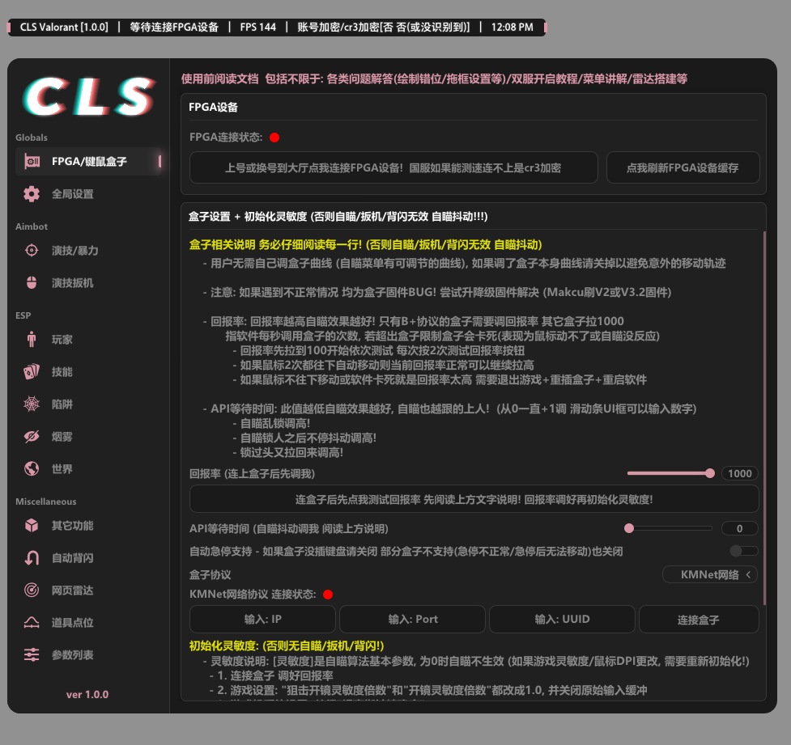  
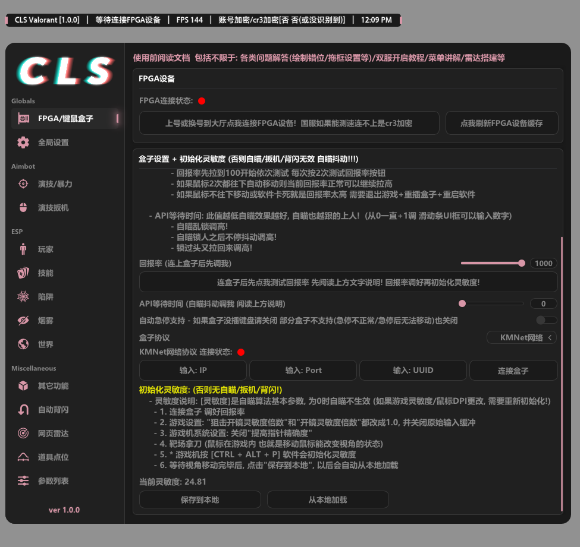  

- **FPGA设备**  
    - 进入游戏后点击连接FPGA设备 (换号无需重启软件 换号进大厅后点连接FPGA即可)  
    - 如果连不上 阅读常见问题文档!  

- **盒子设置 + 初始化灵敏度**  
    - "回报率": 指软件每秒调用盒子鼠标移动的次数, 回报率越高自瞄效果越好  
    - "回报率"调法:  
        - 网络协议盒子一般支持1000, B+串口协议盒子需要手动设置 步骤如下:  
        1. 连盒子后回报率先拉100 点2次测试回报率按钮, 如果2次鼠标都往下动了则正常, 继续往上拉回报率重复此步骤  
        2. 一直到点测试回报率按钮没反应就是回报率太高卡死, 卡死后退出游戏+重插盒子+重开软件 重复步骤1直到测出尽可能高且不卡死的回报率为止  
    - "API等待时间": 指自瞄线程最低多少毫秒执行一次, API等待时间越低自瞄效果越好!  
        - **如果自瞄锁到人之后抖动/自瞄锁过头又拉回来/自瞄抖动乱晃 需要调高"API等待时间"**
    - "API等待时间调法": 每次+1调整, 直到无上述现象  
    - "自动急停支持": 如果盒子没插键盘 或 盒子不支持(急停不正常/急停后无法移动) 都关闭. 关闭后自动急停不生效  
    - **"初始化灵敏度": 仔细阅读软件菜单说明 否则自瞄/扳机无效!**  
        1. 连接盒子 调好回报率  
        2. 游戏设置: "狙击开镜灵敏度倍数"和"开镜灵敏度倍数"都改成1.0, 并关闭原始输入缓冲  
        3. 游戏机系统设置: 关闭"提高指针精确度"  
        4. 靶场拿刀 (鼠标在游戏内 也就是移动鼠标能改变视角的状态)  
        5. 游戏机按 CTRL + ALT + P] 软件会初始化灵敏度  
        6. 等待视角移动完毕后, 点击"保存到本地", 以后会自动从本地加载  

### **全局设置**  
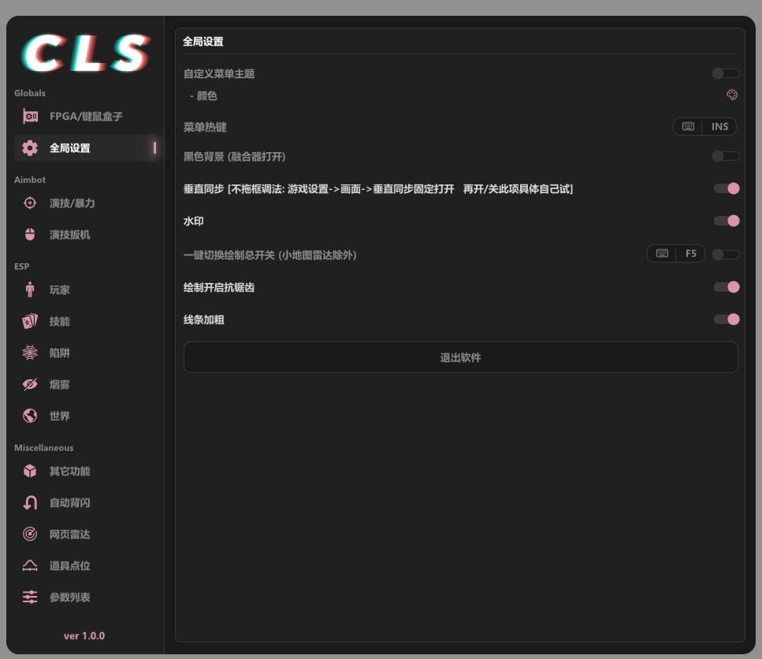  

## **Aimbot**  

**提示: 每类武器单独配置参数! 先点上方你手拿的武器类型图标再调参!**  

- 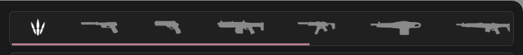  
- 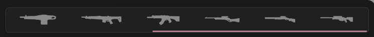  
- 例: 霓虹和婕提大招都是飞镖图标 钱包Q是左轮图标 钱包大招是大狙图标  

**锁可破坏的道具/陷阱(可视时):**  

- 提示: 需自瞄键和此热键一起按才生效  
- 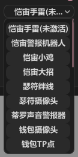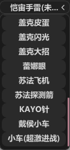  

### **演技/暴力 -> 演技**  

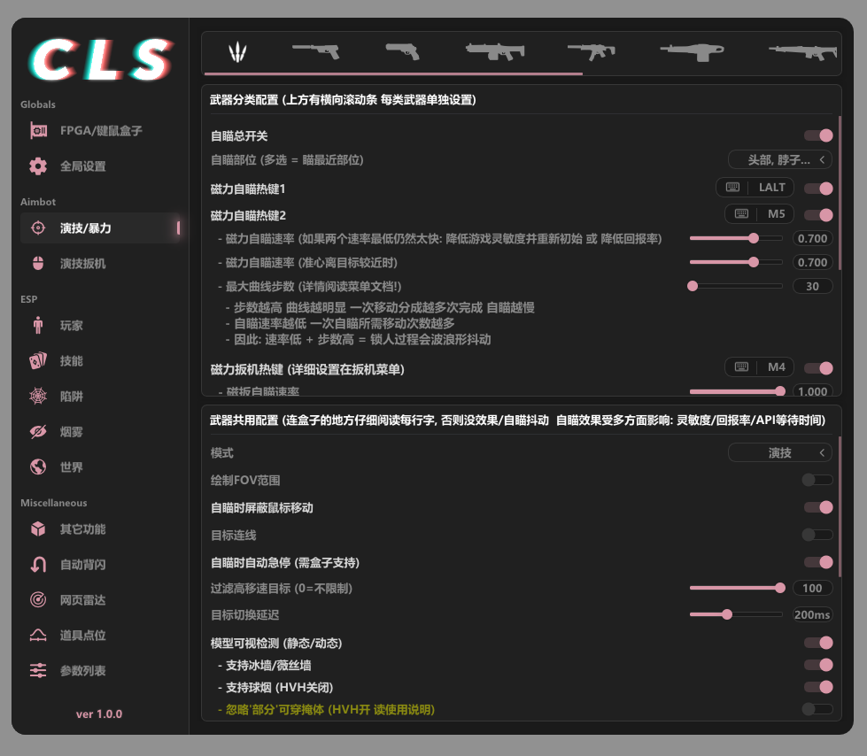  
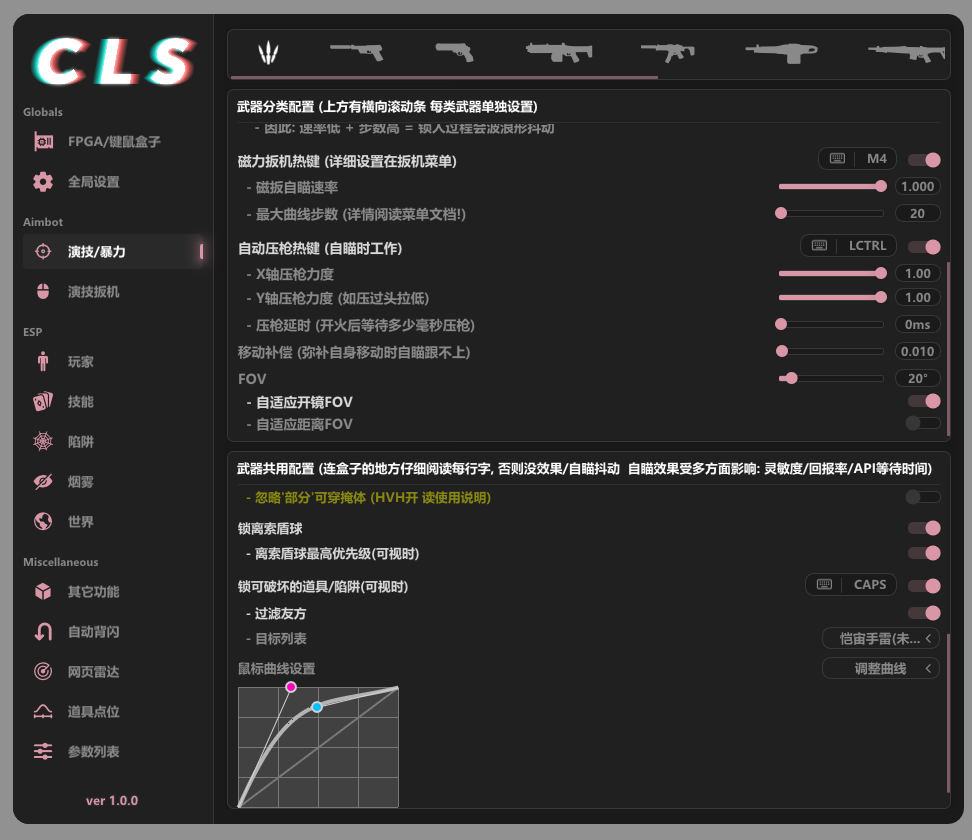  

* **磁力扳机:** 效果等于磁力自瞄+演技扳机, 但磁扳的扳机延迟固定0ms, **每类武器的扳机后座判断和扩散判断到"演技扳机"菜单里设置**  
    * 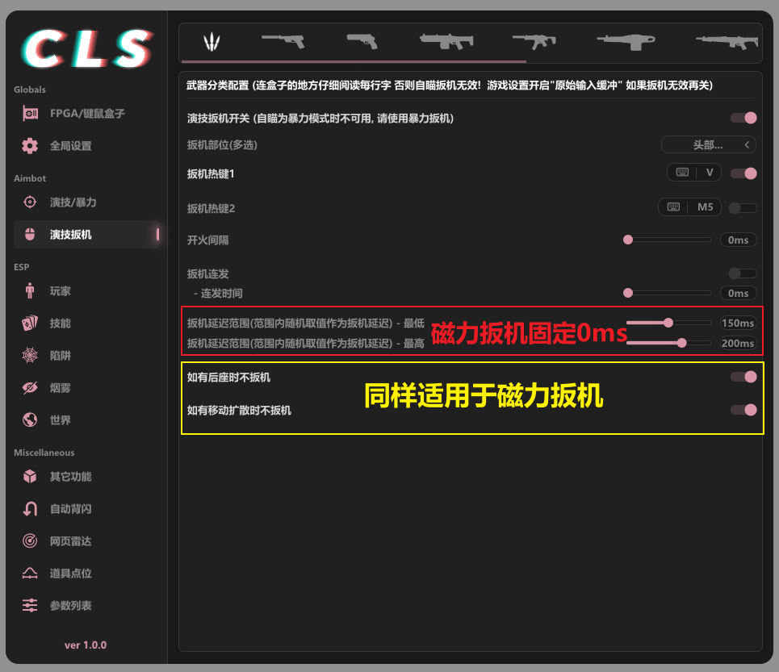  

* **模型可视检测 (静态/动态):**  
    * 模型 – 支持冰墙/薇丝墙: 支持道具墙的可视检测  
    * 模型 – 支持球烟: 支持球烟的可视检测  
    * 模型 – 忽略’部分’可穿掩体: 在暴力模式介绍  
* 离索盾球最高优先级(可见时): 如果盾球和敌人同时可见, 强制优先打盾球  
* 锁可破坏的道具/陷阱(可见时): 自己调整要锁的列表以及快捷键  
* 目标移速限制(0=不限制): 当敌人移速过快时不会自瞄(如Jett的E技能)  
* **曲线讲解 / 最大曲线步数:**  
    * "曲线": 指利用曲线算法规避反作弊鼠标轨迹检测, 曲线轨迹在曲线设置菜单调整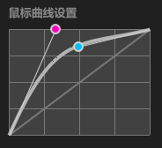  
    * "曲线步数": 一次鼠标移动需要分成多少段完成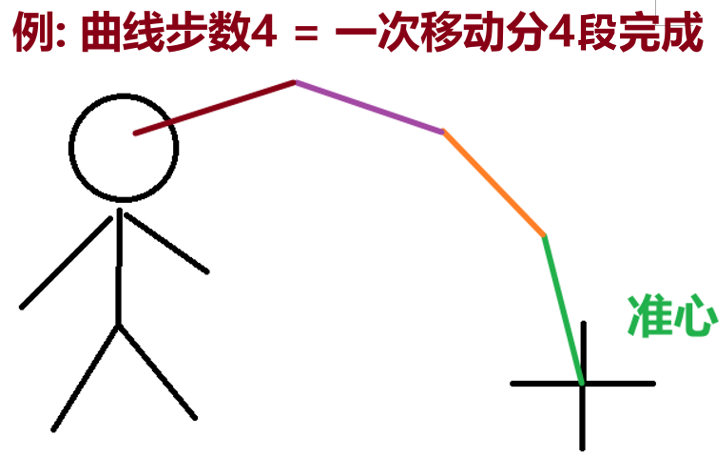  
        * 曲线步数越多曲线越明显, 同时自瞄速度也会越慢  
* **自瞄速率 (磁力/磁扳):**  
    * 自瞄速度由多方面影响: 自瞄速率 / 盒子回报率 / API等待时间 / 最大曲线步数  
    * **速率越低 一次自瞄所需移动次数越多(每次移动都是一条曲线) 每条曲线要分为n步完成**  
        * **例: 假设自瞄速率设置0.2 ~= 锁头分5次完成, 且最大曲线步数设置20, 等同于一次自瞄最多需移动5*20=100次鼠标**  
    * 曲线步数越多曲线越明显, 因此自瞄速率低且曲线步数高会造成自瞄过程波浪线抖动 原理如图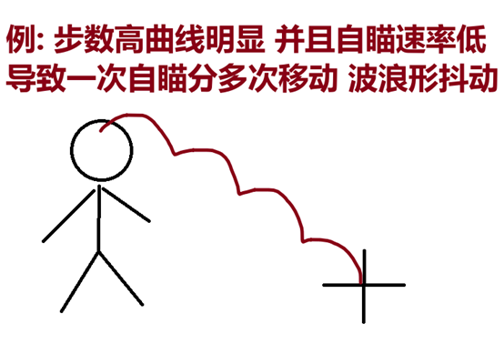  

* **磁力自瞄速率 (准心离目标较近时):** 当准心离目标较近时自瞄速率为此值  
    * 此项用于缓解当自瞄速率较低时 锁到头后敌人移动因自瞄速率低跟不上人  
    * 提示: 当准心离目标较近且目标移动时, 曲线步数会自动降低  

* **移动补偿 (自身移动):** 此值越大, 当自身移动时自瞄速度越快(与自身移动速度成比例)  
    * 此项解决自身移动时自瞄跟不上人  
    * 例如玩霓虹滑铲喷 把霰弹枪移动补偿拉高
* **目标切换延迟:** 自瞄目标切换时的间歇时间  
    * 例如自瞄锁A, 击杀A后自瞄瞬间切换目标到B, 当此值为500ms时 会等500ms再锁B  
* **鼠标曲线设置:** 
    * 调整曲线: 鼠标拉动UI的红点和蓝点调整曲线  
        * 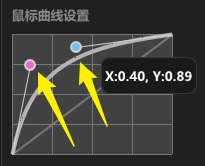  
    * 随机浮动:  
        * 此值是为防止反作弊检测固定曲线而随机变化, 目前反作弊并无此类检测, 因此全0即可  
        * 4个滑动条对应UI上红点和蓝点的位置  
        * 例: 曲线UI红点x坐标是0.5, 随机浮动的红点X是0.2, 则实际的红点x坐标为 0.5 +/- (0 ~ 0.2之间)  
    * 曲线预览: 预览曲线随机浮动后的效果  

### **演技/暴力 -> 暴力**  

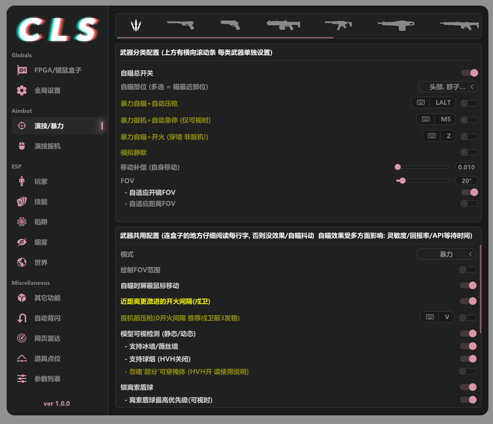  
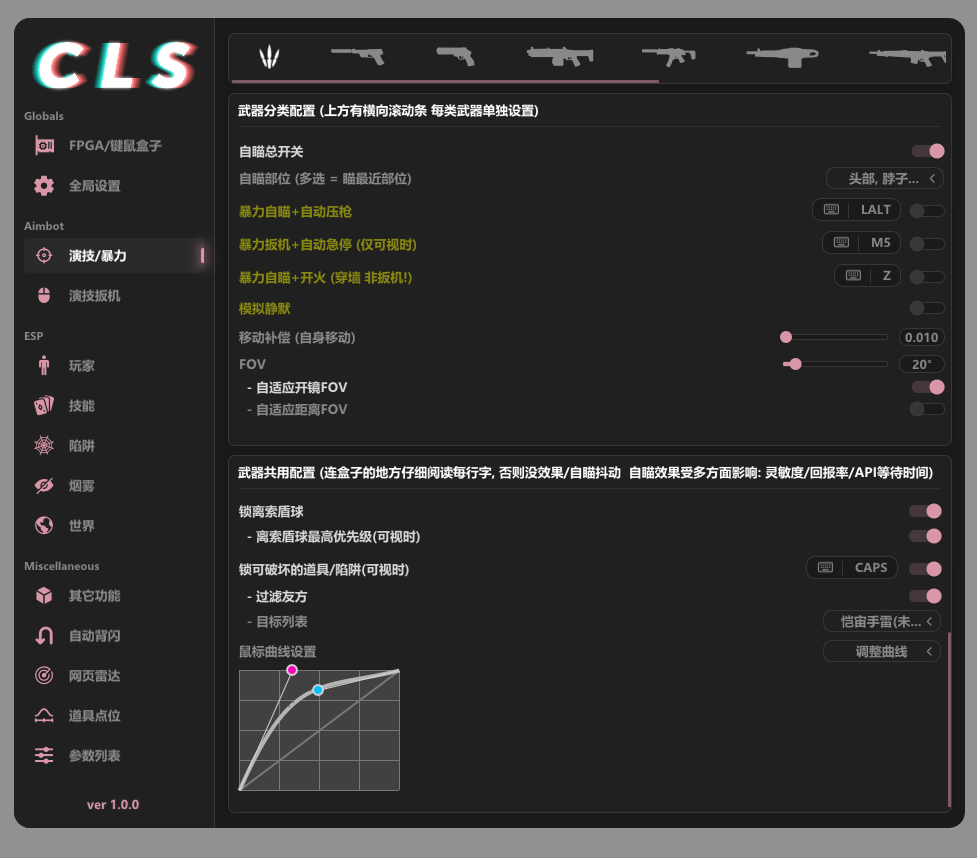  

* **暴力自瞄+自动压枪:** 带自动压枪的暴力自瞄热键  
* **暴力扳机+自动急停(仅可视时):** 当模型检测敌人可见时, 暴力1帧拉枪+扳机  
* **暴力自瞄+开火(穿墙 非扳机!)**  
    * 无论敌人是否可见, 暴力1帧拉枪+开火  
    * 开火间隔会根据后坐力控制, 如需要更激进的开火间隔或0开火间隔后面会介绍  
* **模拟静默:** 模拟静默效果, 非追踪非内存  
* **模型 – 忽略’部分’可穿掩体(HVH开):**  
    * 建议配合使用 “暴力扳机+自动急停(仅可视时)”  
    * 模型检测会忽略部分戍卫可穿的掩体(如箱子 传送门等)  
    * HVH需要穿墙时开启此功能, 如果敌人在可穿掩体后并且此掩体为支持过滤的, 则此掩体会过滤掉, 使可视检测通过  
    * 注意: 只是过滤部分掩体! DMA软件无法像内存注入挂一样做到完美掩体可穿判断, 不要太依赖此功能, 依然主用”暴力自瞄+开火(穿墙 非扳机)”来穿墙  
* **近距离更激进的开火间隔(戍卫):** 与敌人距离越近, 戍卫的开火间隔会越小  
* **扳机前压枪(0开火间隔 戍卫前3发稳):**  
    * 无开火间隔 有多快打多快, 依靠开火前压枪来抵消后坐力 因此适合近距离才开启  
    * 注意: 瓦罗兰特不光有后坐力还有扩散, 两者都是不可预测且扩散完全随机, 因此只有前几发精准  

### **演技扳机**  
**提示: 仅当自瞄模式为"演技"时 此页功能才生效**  
**提示: 扳机唯一检测点是扳机延迟过低以及盒子**  

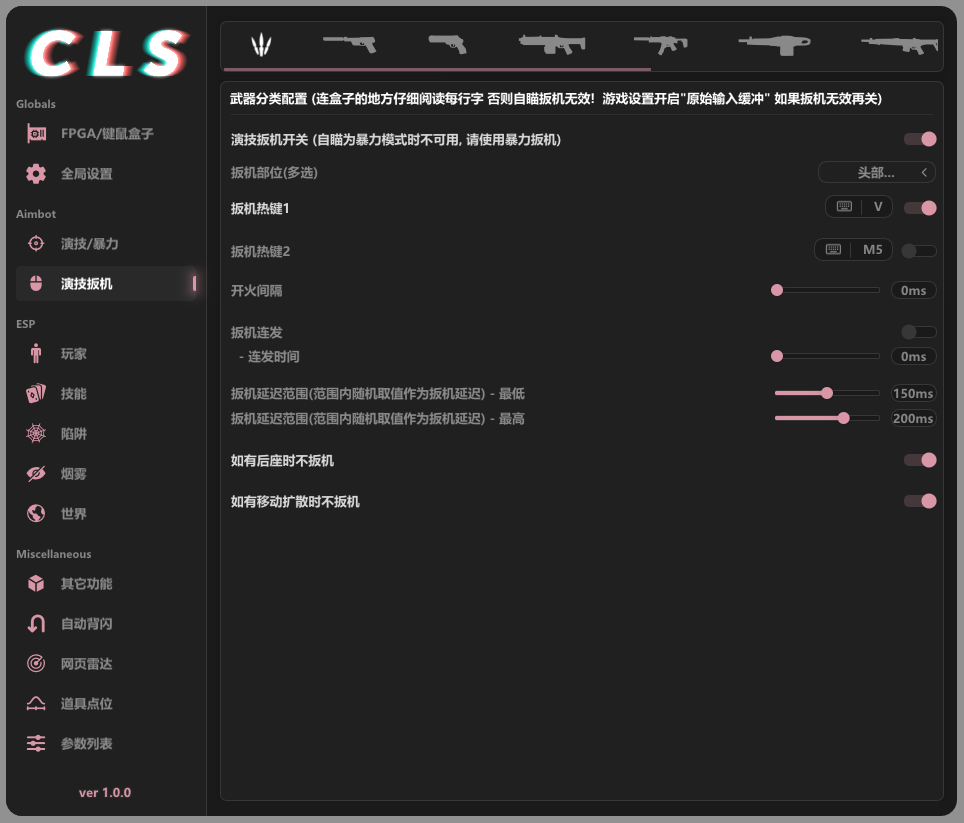  

* **扳机连发:** AK为例 架枪一般2连发/3连发, 开启此项并调连发时间实现此效果  

* **扳机延迟:** 理解为扳机的反应时间 人类极限反应150ms左右  

* **手持后座判断:** 顾名思义 手持的武器/道具会判断后座, 仅无后座力时才扳机  

    * 如Jett飞镖判定为无后座力  

* **手持移动扩散判断:** 手持的武器/道具在移动时如有扩散, 则无扩散时才扳机  
    * 如钱包的Q左轮蹲着走判定为无扩散  

## **ESP**  

### **玩家**  

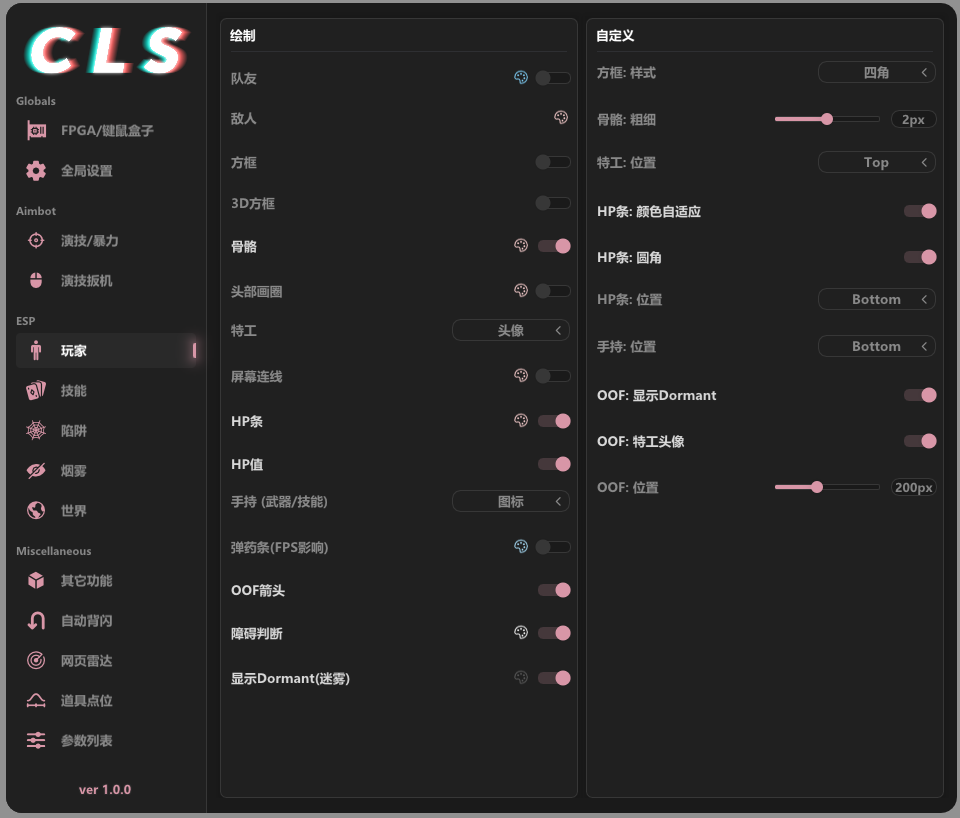  

**提示: Dormant(迷雾)指瓦罗兰特的战争迷雾机制 游戏服务器认为你不应有信息的敌人(比如隔了几堵墙) 则不会下发玩家坐标**  

- 如果不想绘制迷雾可自行关闭 迷雾颜色默认灰色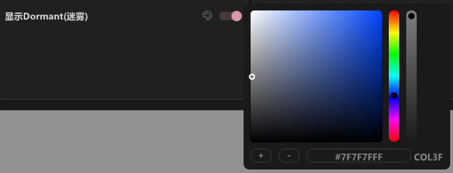  

* **弹药条(FPS影响):** 开了会读取子弹数量 因此影响绘制FPS  
* **OOF箭头:** OOF = Out of Screen. (视角外敌人箭头)  

### **技能**  

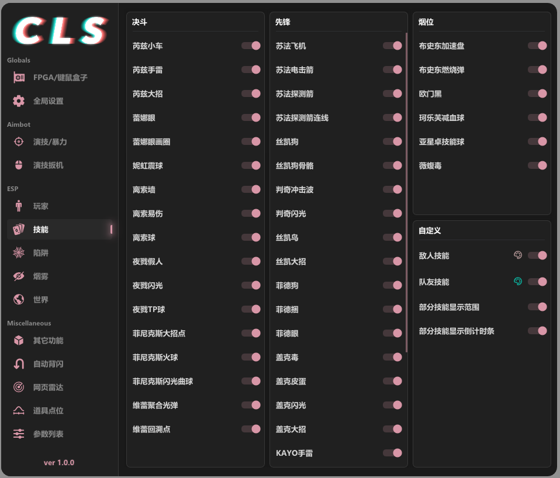  

- **苏法探测箭连线:** 敌方苏法射出探测箭时, 准心会和箭连线  

### **陷阱**  

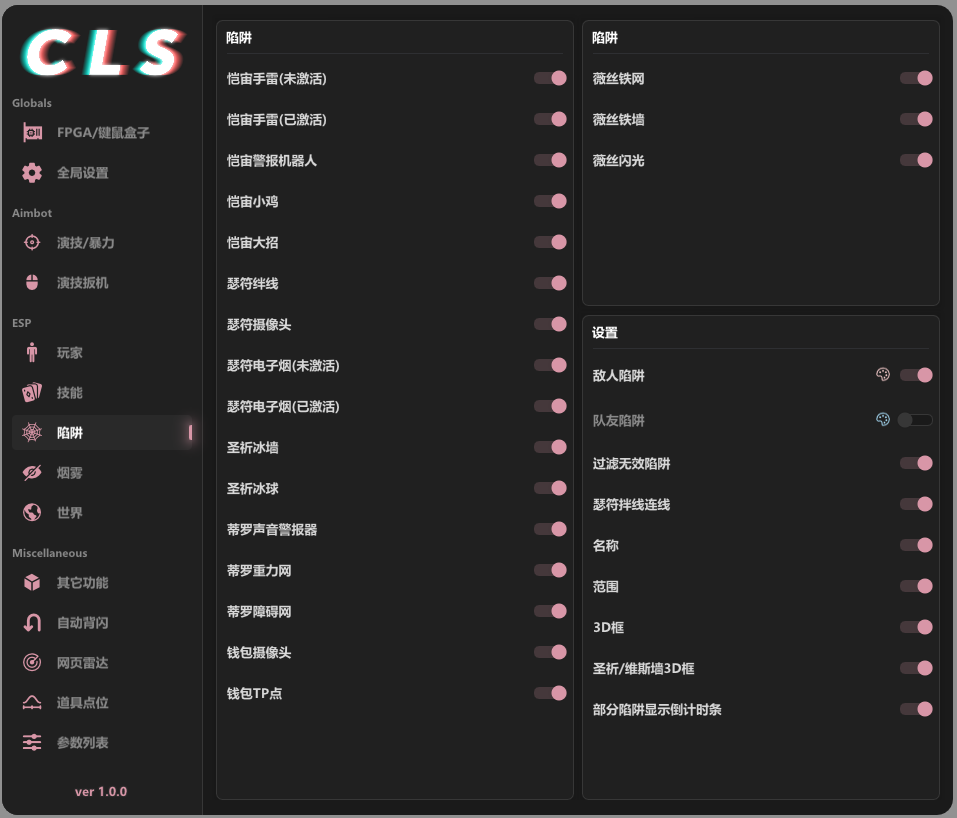  

- **过滤无效陷阱:** 过滤敌人死后则无效的陷阱  
    - 例如瑟符绊线会过滤, KJ已激活的手雷不会过滤等  
- **瑟符绊线连线:** 顾名思义, 瑟符绊线的两端会连线  

### **烟雾**  

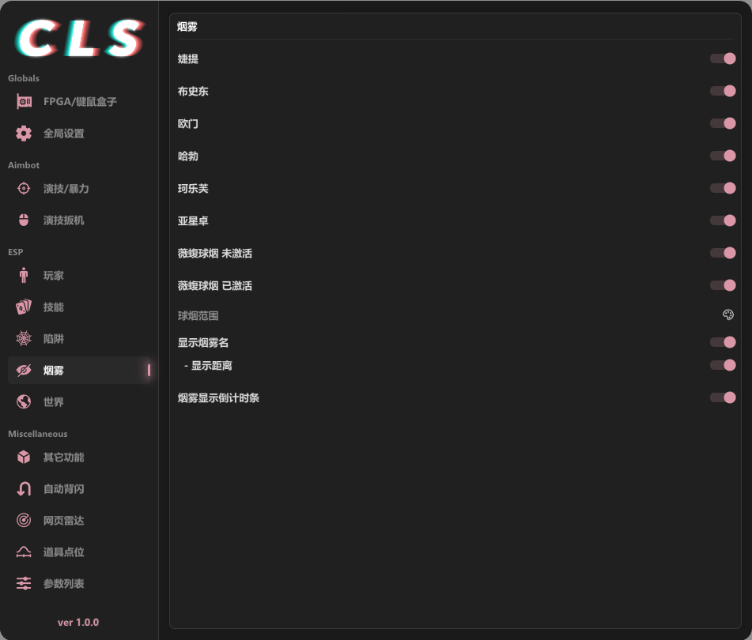  

### **世界**  

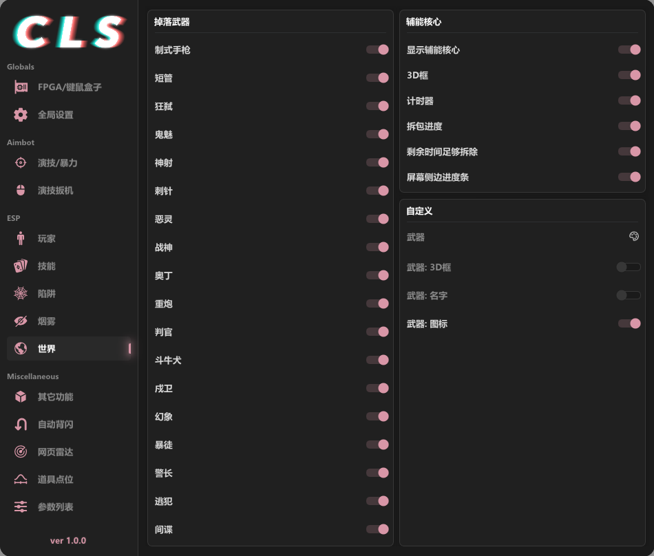  

## **Miscellaneous**  

### **其它功能**  

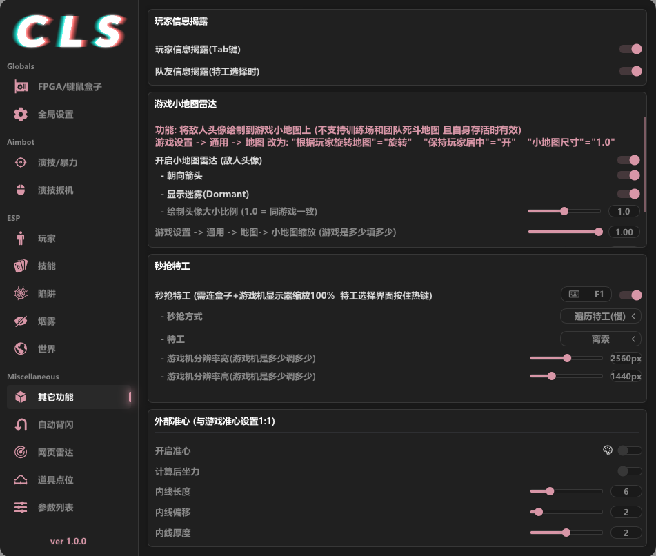  

- **玩家信息揭露(Tab键):** 游戏内按Tab显示玩家信息: [特工 昵称 段位 排行榜 等级]  
- **队友信息揭露(特工选择时):** 同理 特工选择时自动显示队友信息 无需按Tab  
- **游戏小地图雷达:** 阅读菜单说明  
    - 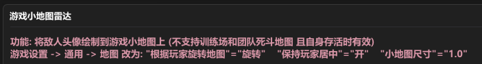  
    - 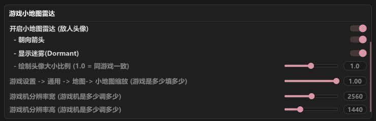  
- **秒抢特工(特工选择界面按住热键):**  
    - 此功能需要连接KMBox  
    - 匹配成功要进入特工选择时就按住热键, 会自动抢特工  
    - 不同电脑因配置和网速进入特工选择的时间不一致, 可能别人进的比你快就先抢了  
    - **秒抢方式: 遍历特工(慢):**  
        - 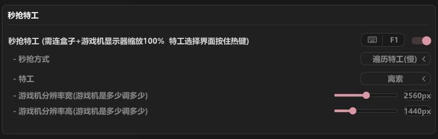  
    - **秒抢方式: UI定位(快):**  
        - 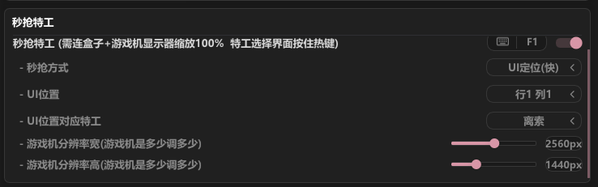  
        - UI位置: 要选的特工在游戏特工选择列表的第几行第几列, 建议先进自定义记好位置  
        - UI位置对应特工: 字面意思 如行2列3是婕提  
- **外部准心:**  
    - 在最顶层绘制准心, 防止绘制挡到游戏准心  
    - 外部准心完全和瓦罗兰特游戏准心设置1:1  

### **自动背闪**  

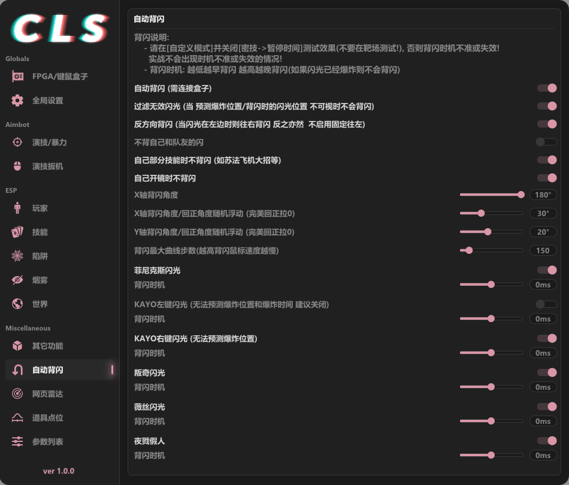  

- **请在[自定义模式]并关闭[密技->暂停时间]测试背闪参数 (不要在靶场测试 否则背闪时机不准或失效!)**  

### **网页雷达**  

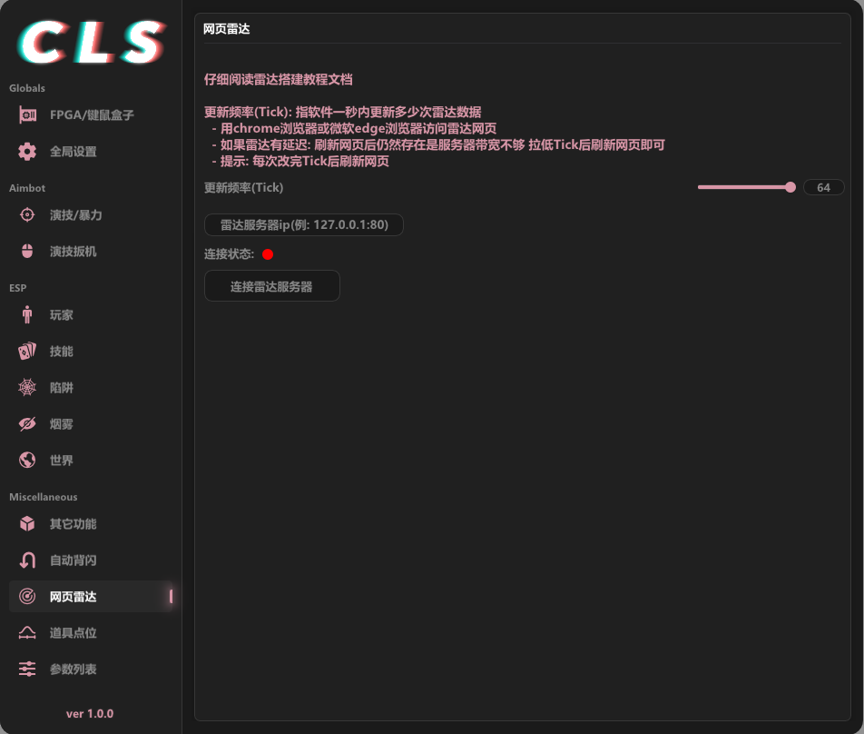  

**提示: 仔细阅读雷达搭建教程文档**  

**提示: 雷达不支持训练场和团队死斗地图, 只支持普通地图**  

### **道具点位**  

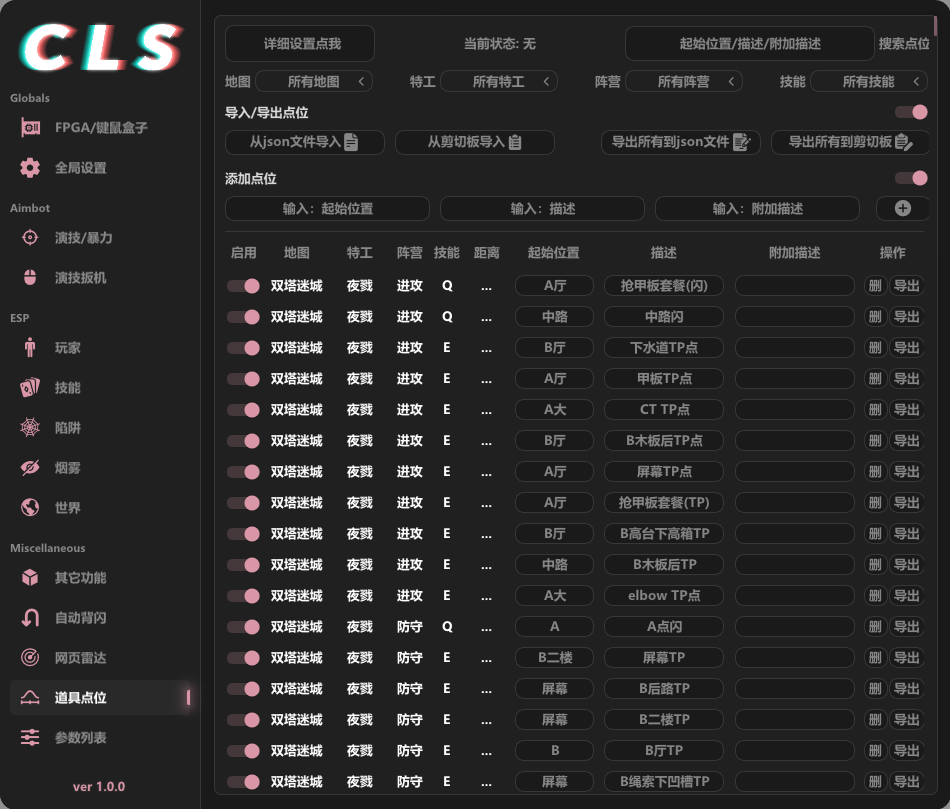  

**提示: 目前CLS提供的默认点位只有几张地图 (截止2025年6月)**  

**提示: json点位文件路径在"辅助目录/UserData (参数 点位 cpuid 版本号文件 都放里面)/Lineups.json"**  

- 自带的Lineups.json只录入了三个图的点位数据, 需要其它地图点位请自行录入  
- 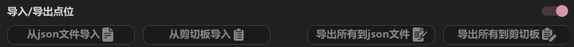  

---

- **过滤当前技能:**  
    - 例: 手持C技能, 则只显示C技能的Lineup点位  
    - 如果特工的道具无法切出来拿到手上(例如保安的Q技能一掏出来就扔了), 则关闭此选项  
- ***如何添加点位:*** 拿好道具并瞄好点位, 输入点位信息 点添加按钮  
    - 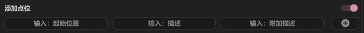  

## **参数列表**  

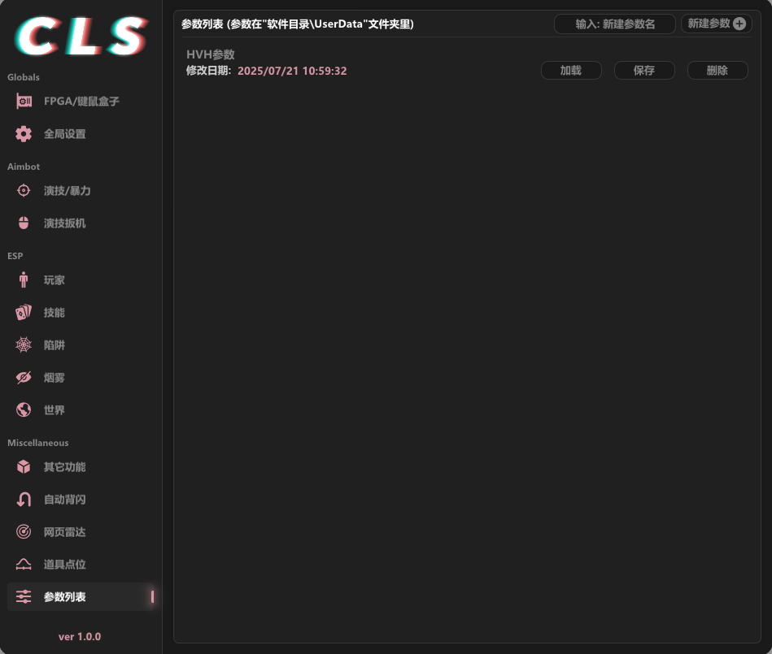  

**提示: 参数保存了就要点加载**  

***如何新建参数:*** 右上角输入新参数名后 点新建参数按钮  

- 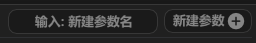  
