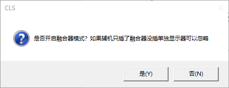
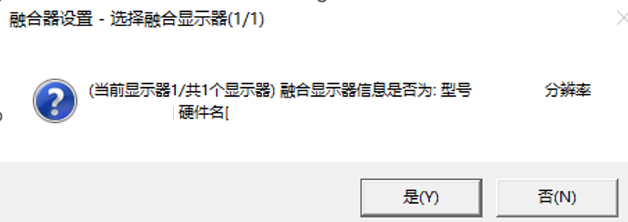

# **常见问题疑难解答**

遇到问题先关软件游戏别退 打开DMA测速工具确保测速正常!  

- 港服挂10分钟测速确保固件未屏蔽  

测速没问题再阅读此文档!  

## **国服ACE反作弊提示开启VT-D**
VT-D介绍:  

- ACE针对DMA作弊的检测手段  
- 开启VTD后ACE有权限监控DMA读了哪些内存, 检测是否读取受保护的游戏内存(例如透视所需的位置数据)  

DMA软件方难以处理 圈内主流绕过手段如下 (具体自行解决)  

- 无盘网吧系统
- 魔改BIOS
- 隐藏PCIE固件
- 修复游戏  
- 屏蔽VTD针脚 (可行性未知)
- 主机使用工具或其它手段屏蔽VTD弹窗 (可能会三软等)
- 等待DMA行业突破

## **软件提示读取cpuid.ini失败**
阅读国服/港服开启教程  

  - 提示：每次机器码变动或做了动态机器码 需要重新采集cpuid  

## **初始化键盘失败**
原因: 主机系统过旧  

- 建议安装较新的"Windows10 x64 22H2 专业版"  
- 系统安装完成后, 系统设置里检查一次Windows更新(使系统小版本更新)

## **港服右下角一直显示"等待VGK加密"(超过5分钟)**
原因: cpuid变了没重新采集, 或采集的是副机而非主机的cpuid信息!  

  - 仔细阅读教程文档!

## **自瞄/扳机没效果**
仔细阅读软件菜单第一页

## **辅机除融合器外还有显示器时，软件绘制在辅机显示器而非融合器上**
仔细阅读菜单介绍文档
原因: 开启软件时弹出的融合器对话框没选对融合器显示器  

-   
- 

