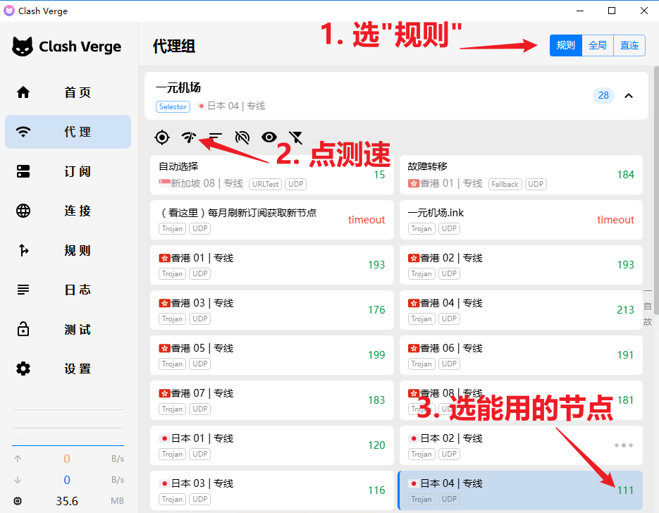

# **梯子购买/使用教程**  

**部分国内用户如果报服务器相关错误请使用梯子**  

## **机场购买(自己有机场的忽略)**  

浏览器访问 "一元机场.ink", 注册登录后选择套餐  

-   

购买后到"我的订阅"里复制Clash订阅链接  

-   

## **Clash设置**  

副机安装Clash  

-   

打开Clash 导入刚才复制的订阅链接  

-   

Clash切到刚才导入的订阅  

-   

代理模式选"全局", 选择测速能用的节点(东南亚节点除外)  

-   

开启"虚拟网卡模式(Tun)"

-   

梯子部署完毕 打开辅助登录器即可