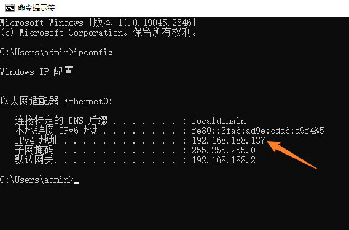
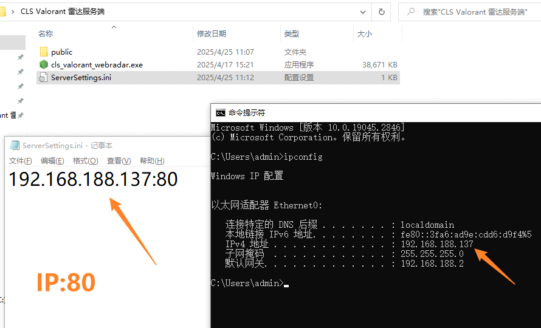
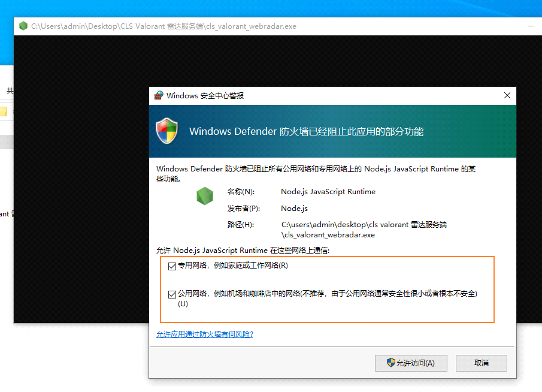
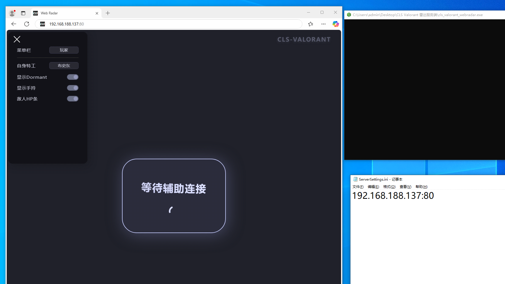

# **网页雷达搭建和使用**

**提示:**  

- 雷达网页请用微软Edge浏览器 / Google Chrome浏览器访问!  
- 菜单连上雷达服务器后网页仍然显示”等待辅助连接”, 服务器雷达端口没有开UDP协议入方向!  

## **自行购买云服务器**  

- 自行购买Windows云服务器(支持远程桌面连接的)  
    - 云服务器配置:  
        - 最低2H2G, 推荐4H4G  
        - 网络带宽不低于10M  
    - 服务器配置:  
        - 雷达端口(80为例)的TCP+UDP协议开放出入  

## **搭建到本地副机教程(先学会本地搭建)**  

1. 获取副机内网ip  
    - 打开cmd 输入"ipconfig"  
    - 一定要选对你的网卡对应的IPv4地址 (示例的电脑中网卡只有一个)  
        - 例如辅机如果是连Wifi上网, 这里则选Wifi网卡的IPv4地址  
        - 如果ipconfig输出很多张网卡不知道选哪个, 可以到设备管理器一个一个禁用网卡, 哪个禁用掉不能上网的则是要找的网卡  
    - 示例中 内网ip为"192.168.188.137"  
2. ServerSettings.ini中填写: IP+英文冒号+端口  
    - 默认填80, 如果被占用可以改成别的  
    -   
3. 运行cls_valorant_webradar.exe 搭建完成  
    -   
    - 提示: 黑框是正常现象  
4. 打开雷达网页  
    - 示例中为"192.168.188.137:80"  
    -   
    - 服务端搭建完成 (此时是搭建到内网, 别人无法访问网页)  
5. 软件菜单连接雷达  
    - 输入"192.168.188.137:80"  

## **搭建到云服务器**  
- **提示: 搭建方法与本地搭建基本一致, 区别是IP不要用ipconig获取, 而是填写服务器公网IP**  
- 先到云服务器控制台 -> 安全组 允许80端口(或者全端口)的所有协议出/入, 允许的IP填0.0.0.0/0, 表示允许所有IP出/入  
    - 如: 雷达端口是80, 服务器后台开启80端口的TCP协议+UDP协议 允许出/入  
    - 否则菜单连上雷达后网页仍然显示"等待辅助连接"!  
- 运行cls_valorant_webradar.exe后, 浏览器输入IP:80进入网页雷达  
    - 例如云服务器IP是123.123.123.123, 雷达的ServerSettings.ini则填写123.123.123.123:80  
    - 雷达网址 http://123.123.123.123:80  
